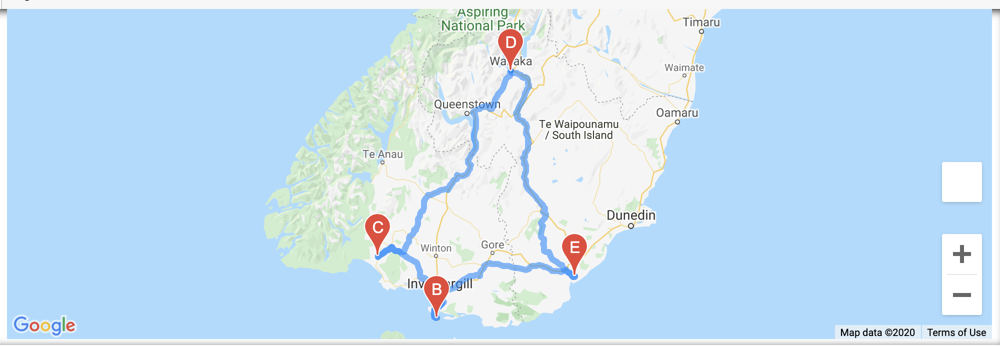
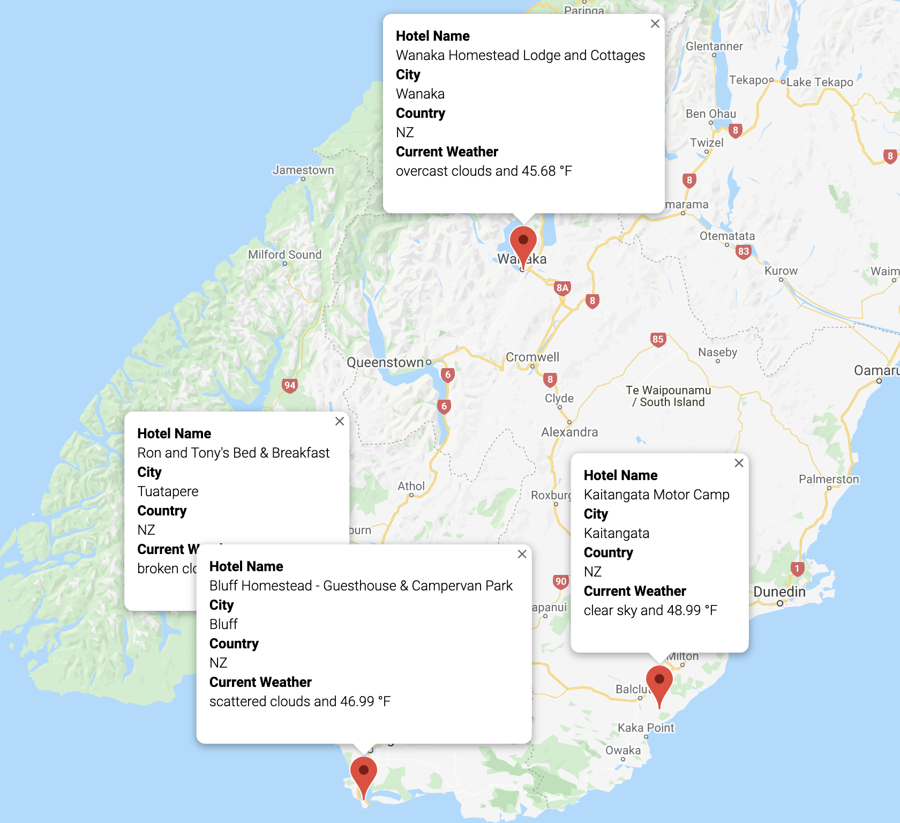

# World Weather Analysis
Gathering weather and travel information with with OpenWeatherMap and Google Maps APIs

This project was built around providing functionality to an app called **PlanMyTrip**. The key deliverables were:
- retrieve weather data from the OpenWeatherMap.org API;
- create a map of potential travel destinations using the Google Map API, based on customer's temperature preference input;
- create a travel itinerary map, using Google Maps Directions API and a selection of four destinations.

### The first deliverable
... is contained within the [Weather_Database](Weather_Database) subfolder. The primary purpose of this code is to:
- create a random list of 2000 latitude/longitude pairs;
- from those coordinate, create a list of cities which are 'nearby' and are not duplicated (reduced to ~860 cities);
- pull current weather data for all the cities on the list (temp, humidity, cloudiness, wind speed, and weather description);
- export this data to a csv file to be used later.

### The second deliverable
... is contained within the [Vacation_Search](Vacation_Search) subfolder. This code uses the city and weather data contained in the previously created csv file. It preforms the following actions:
- takes weather range inputs from the user on minimum and maximum temperatures, and uses those figures to refine the list of cities;
- uses the Google Maps Nearby search API to find hotels in the refined list of cities;
- exports a cleaned dataframe of this data, including hotel info, to a csv file;
- uses the Google Maps API to create a map and marker layer showing all potential travel destinations.

### The third and final deliverable
... is contained within the [Vacation_Itinerary](Vacation_Itinerary) subfolder. This code uses the csv created in the previous section to:
- create an itinerary map with four locations and a route layer;

- create a map showing the above locations with relevant hotel and weather data.
